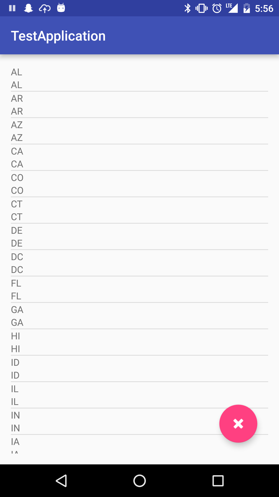
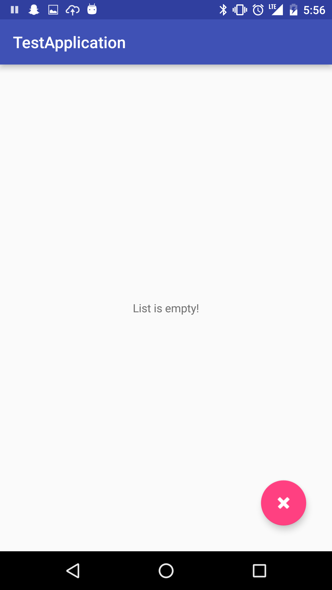

# Android Development Instructional Support Code Challenge

Thanks for your interest in becoming an IA or TA for General Assembly's Android Development course! The following code challenge is designed to test your ability to troubleshoot and repair a broken Android app.  

## Technical Specs

We've provided you with [some starter code in this repo](/TestApplication/). Go ahead and run this code in Android Studio. The code provided is broken in a few fundamental ways and will not run properly. Please fix the broken code to implement the following three features:

**1. When opened, the app should display a list of abbreviations of U.S. states, as seen in the screenshot below:**

**2. Clicking on a state abbreviation should take the user to a page that displays that state's position in the list:**

**3. Clicking the red "delete" button on the main screen should erase the entire list of abbreviations.**

## How to submit

1. Clone this repo and begin working on your solution--please don't fork this repo, otherwise it will be easy for others to find your solution!
2. Once you've successfully implemented the three features, take a video of the working app, demoing the three features. If you've never recorded a video using Android Studio, [see this article](http://developer.android.com/tools/debugging/debugging-studio.html#screenCap) for instructions.
3. When you're all done, **please submit both your video and a link to your code on GitHub** to your producer or recruiter.
